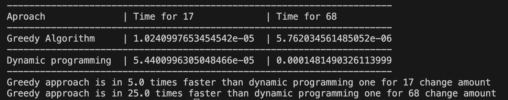

# goit-algo-hw-09
Greedy algorithm vs Dynamic Programming. 
The effectiveness investigation of the both approaches while solving task to find min amount of coins for the change.

We have solved task to find min amount of coins needed for some change amount in two ways, using greedy algorithm approach and dynamic programming. The results are depicted in the next table:

As we can see greedy algorithm solving approach is faster than dynamic programming one in several times and its effectiveness increases significantly with the input data amount increase. It is perfect match for such type tasks solving. 
But still we should remmember that sometimes greedy algorithm couldn't find the optimal solution for some type of tasks. In this case we should use dynamic programming, which is slower but insures the optimal result in any case. 